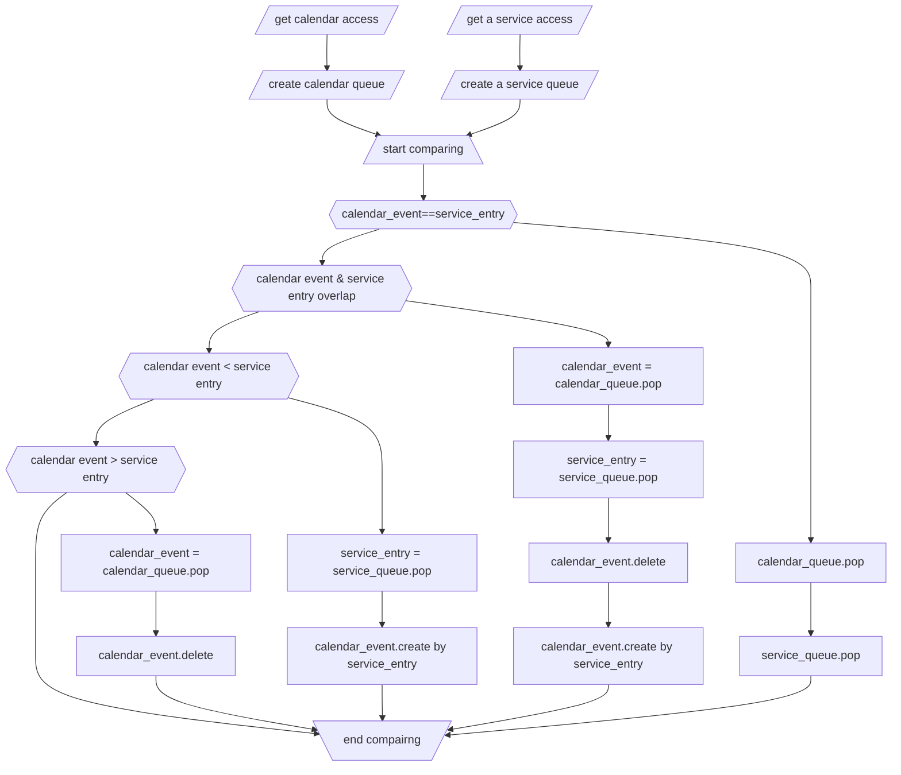

# Flowchart;

```mermaid
graph TD;
    getCalendarAccess[/get calendar access/]-->createCalendarQueue;
    createCalendarQueue[/create calendar queue/]-->startComparing;
    getOtherServiceAccess[/get a service access/]-->createServiceQueue;
    createServiceQueue[/create a service queue/]-->startComparing;

    startComparing[/start comparing\]-->ifServiceEntryEqCalendarEvent;
    ifServiceEntryEqCalendarEvent{{calendar_event==service_entry}}-->ifServiceEntryAndCalendarEventOverlapping;
    ifServiceEntryAndCalendarEventOverlapping{{calendar event & service entry overlap}}-->ifCalendarEventIsFaster;
    ifCalendarEventIsFaster{{calendar event < service entry}}-->ifCalendarEventIsLater;
    ifCalendarEventIsLater{{calendar event > service entry}}-->endComparing;
    endComparing[\end compairng/];

    ifServiceEntryEqCalendarEvent-->popCalendarQueue1;
    popCalendarQueue1[calendar_queue.pop]-->popServiceQueue1;
    popServiceQueue1[service_queue.pop]-->endComparing;

    ifServiceEntryAndCalendarEventOverlapping-->popCalendarQueue2;
    popCalendarQueue2[calendar_event = calendar_queue.pop]-->popServiceQueue2;
    popServiceQueue2[service_entry = service_queue.pop]-->deleteCalendarEvent2;
    deleteCalendarEvent2[calendar_event.delete]-->createCalendarEvent2;
    createCalendarEvent2[calendar_event.create by service_entry]-->endComparing;

    ifCalendarEventIsFaster-->popServiceEntry3;
    popServiceEntry3[service_entry = service_queue.pop]-->createCalendarEvent3;
    createCalendarEvent3[calendar_event.create by service_entry]-->endComparing;

    ifCalendarEventIsLater-->popCalendarEvent4;
    popCalendarEvent4[calendar_event = calendar_queue.pop]-->deleteCalendarEvent4;
    deleteCalendarEvent4[calendar_event.delete]-->endComparing;
```
