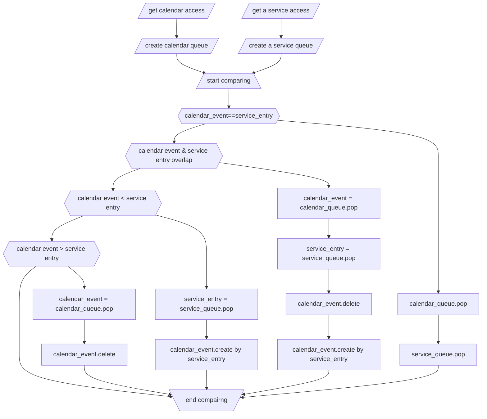
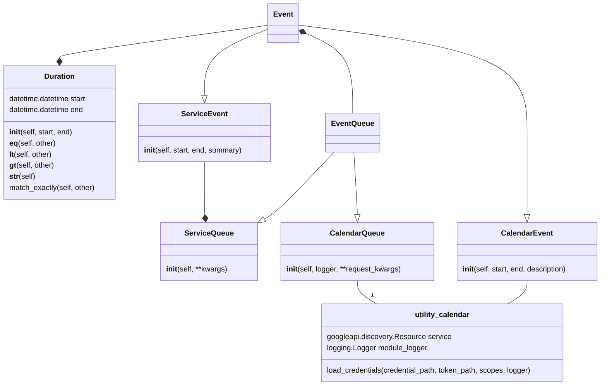

# Flowchart;

```mermaid
graph TD;
    getCalendarAccess[/get calendar access/]-->createCalendarQueue;
    createCalendarQueue[/create calendar queue/]-->startComparing;
    getOtherServiceAccess[/get a service access/]-->createServiceQueue;
    createServiceQueue[/create a service queue/]-->startComparing;

    startComparing[/start comparing\]-->ifServiceEntryEqCalendarEvent;
    ifServiceEntryEqCalendarEvent{{calendar_event==service_entry}}-->ifServiceEntryAndCalendarEventOverlapping;
    ifServiceEntryAndCalendarEventOverlapping{{calendar event & service entry overlap}}-->ifCalendarEventIsFaster;
    ifCalendarEventIsFaster{{calendar event < service entry}}-->ifCalendarEventIsLater;
    ifCalendarEventIsLater{{calendar event > service entry}}-->endComparing;
    endComparing[\end compairng/];

    ifServiceEntryEqCalendarEvent-->popCalendarQueue1;
    popCalendarQueue1[calendar_queue.pop]-->popServiceQueue1;
    popServiceQueue1[service_queue.pop]-->endComparing;

    ifServiceEntryAndCalendarEventOverlapping-->popCalendarQueue2;
    popCalendarQueue2[calendar_event = calendar_queue.pop]-->popServiceQueue2;
    popServiceQueue2[service_entry = service_queue.pop]-->deleteCalendarEvent2;
    deleteCalendarEvent2[calendar_event.delete]-->createCalendarEvent2;
    createCalendarEvent2[calendar_event.create by service_entry]-->endComparing;

    ifCalendarEventIsFaster-->popServiceEntry3;
    popServiceEntry3[service_entry = service_queue.pop]-->createCalendarEvent3;
    createCalendarEvent3[calendar_event.create by service_entry]-->endComparing;

    ifCalendarEventIsLater-->popCalendarEvent4;
    popCalendarEvent4[calendar_event = calendar_queue.pop]-->deleteCalendarEvent4;
    deleteCalendarEvent4[calendar_event.delete]-->endComparing;
```

# Class Diagram

```mermaid
classDiagram

Event --* Duration
Duration: datetime.datetime start
Duration: datetime.datetime end
Duration: __init__(self, start, end)
Duration: __eq__(self, other)
Duration: __lt__(self, other)
Duration: __gt__(self, other)
Duration: __str__(self)
Duration: match_exactly(self, other)

Event --|> ServiceEvent
ServiceEvent: __init__(self, start, end, summary)
Event *-- EventQueue

EventQueue --|> ServiceQueue
ServiceEvent --* ServiceQueue
ServiceQueue: __init__(self, **kwargs)

Event --|> CalendarEvent
CalendarEvent: __init__(self, start, end, description)
EventQueue --|> CalendarQueue
CalendarQueue: __init__(self, logger, **request_kwargs)

CalendarEvent -- "1" utility_calendar
CalendarQueue -- "1" utility_calendar
utility_calendar: googleapi.discovery.Resource service
utility_calendar: logging.Logger module_logger
utility_calendar: load_credentials(credential_path, token_path, scopes, logger)
```
